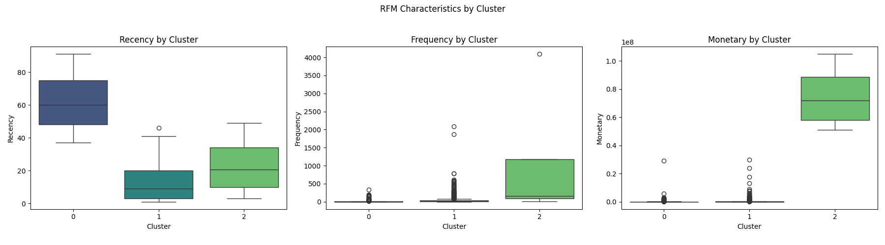

# 🏦 Alternative Data Credit Risk Model   

### Folder structure
```
│ README.md
│ requirements.txt
│ Dockerfile
│
├───data
│ ├───raw
│ │ Xente_dataset.csv
│ │ Xente_Variable_Definitions.csv
│ │
│ └───processed
│ cleaned_data.csv
│ features.csv
│
├───notebooks
│ 1.0-eda.ipynb
│
├───plots
│ └───task-2
│ amount_dist.png
│ fraud_by_hour.png
│ category_fraud.png
│ correlation_heatmap.png
│
├───src
│ │ data_processing.py
│ │ train.py
│ │ predict.py
│ │
│ └───api
│ main.py
│ pydantic_models.py
│
└───tests
test_data_processing.py
test_models.py

```

## ✔️ Task 1: Data Collection & Understanding

- Loaded dataset: `data.csv` from Xente's transaction platform  
- Reference documentation: `Xente_Variable_Definitions.csv` for feature meanings  
- Identified target variable:  
  - `FraudResult` (1 = Fraud, 0 = Not Fraud)

## ✔️ Task 2: Exploratory Data Analysis (EDA)

### Data Distribution Analysis
- Analyzed class balance: Fraud vs Non-Fraud cases
- Examined transaction patterns:
  - Timing by hour of day
  - Amount distributions

### Categorical Variable Investigation
Visualized relationships between `FraudResult` and:
- `ProductCategory` 
- `ChannelId`
- `PricingStrategy` 
- `CountryCode`
- `CurrencyCode`

### Numerical Analysis
- Generated correlation heatmap for numeric features

### Outputs
All plots saved to: `plots/task-2/`

### Directory
EDA is done in `notebooks/1.0-eda.ipynb/`


## ✔️ Task 3: Automated Feature Engineering

This task focuses on transforming the raw, transaction-level data into a clean, aggregated, and model-ready dataset at the customer level. All logic is encapsulated in a reproducible script, a critical step in moving from exploration to a production-ready system.

## 1. The Goal

The primary objective is to create a feature set that describes each customer's historical behavior. Since credit risk is assessed at the customer level, not the transaction level, this aggregation is the most crucial transformation in the project. The final output is a single, clean CSV file located at `data/processed/processed_customer_data.csv`.

## 2. The Implementation: `src/feature_engineering.py`

I have built a robust data processing pipeline using scikit-learn. This approach ensures that every transformation is repeatable and can be easily integrated into a future model training workflow.

The script performs two major operations:

### A. Feature Aggregation (`AggregateFeatures` Transformer)

A custom scikit-learn transformer was built to group the raw data by `CustomerId` and engineer a set of powerful behavioral features. The key features created are:

- **Recency (R)**: Days since the customer's last transaction.
- **Frequency (F)**: Total number of transactions made by the customer.
- **Monetary (M)**: Total monetary value of all transactions for the customer.

**Behavioral Metrics:**
- `AvgTransactionValue`: The customer's average spending per transaction.
- `StdTransactionValue`: The standard deviation of their transaction values, indicating spending consistency.
- `NumUniqueProducts`: The variety of product categories the customer has purchased from.
- `MostFrequentChannel`: The primary channel used by the customer.

### B. Preprocessing Pipeline (`ColumnTransformer`)

Once the data is aggregated to the customer level, a standard preprocessing pipeline is applied to prepare it for machine learning:

- **Numerical Features**: All numerical columns (`Recency`, `Frequency`, etc.) are scaled using `StandardScaler`. This normalizes the features to have a mean of 0 and a standard deviation of 1, which is essential for many ML algorithms.
- **Categorical Features**: The `MostFrequentChannel` column is converted into numerical format using `OneHotEncoder`. This creates new binary columns for each channel, allowing the model to interpret them correctly.

The entire process is automated within the script, ensuring consistency every time it is run.

## 3. How to Run the Script

To regenerate the processed data from the raw dataset, ensure all dependencies are installed and run the script from the project's root directory.

1. **Activate the virtual environment:**

```bash
   .\venv\Scripts\activate

```

2. **Install dependencies**

```bash
  pip install -r requirements.txt
```
3. **Execute the script from the project root**

```bash
python src/feature_engineering.py
```

Upon successful execution, the script will print the shape and a sample of the final processed DataFrame and save it to data/processed/processed_customer_data.csv.

## Task 4: Proxy Target Variable Engineering

A critical challenge in this project is the absence of a direct "default" or "credit risk" label in the dataset. To train a supervised machine learning model, this task engineers a proxy target variable representing credit risk based on customer engagement patterns. The assumption is that the least engaged customers are the most likely to represent higher credit risk.

## 1. The Goal

The objective is to programmatically identify a segment of "high-risk" customers and create a binary target column named `is_high_risk`. This column serves as the ground truth for training predictive models. The final output is a complete training dataset located at `data/processed/final_training_data.csv`.

## 2. The Implementation: `src/create_target_variable.py`

The script uses RFM (Recency, Frequency, Monetary) analysis combined with K-Means clustering to segment customers. Here's the step-by-step process:

### A. Calculate RFM Metrics
For each unique `CustomerId`, the script calculates:
- **Recency**: Days since the customer's last transaction
- **Frequency**: Total number of transactions
- **Monetary**: Total monetary value of all transactions

### B. Scale Features for Clustering
RFM features are scaled using `StandardScaler` to ensure equal weighting in the clustering algorithm (K-Means is distance-based).

### C. K-Means Clustering
Customers are segmented into 3 distinct clusters using `KMeans` (with `random_state=42` for reproducibility).

Clusters are analyzed to identify the "high-risk" group based on:
- Highest average Recency (least recent activity)
- Lowest average Frequency (fewest transactions)
- Lowest average Monetary value (lowest spend)

### D. Visual Validation
Boxplots are generated to confirm cluster characteristics:



*Figure 4: RFM characteristics by cluster, showing the distinct profiles of the three customer segments.*

### E. Create Target Variable
A binary column `is_high_risk` is added:
- `1` for customers in the high-risk cluster
- `0` for all others

This target variable is merged with the feature-engineered dataset from Task 3 (`processed_customer_data.csv`) to create the final training set.

## 3. How to Run the Script

**Prerequisite**: Ensure Task 3's output (`data/processed/processed_customer_data.csv`) exists.

1. **Activate the virtual environment**:
```bash
   # Windows
   .\venv\Scripts\activate
```
2. **Run the script from the project root:**
```bash
python src/create_target_variable.py
```
 
3. **Outputs**
 - Final training dataset: data/processed/final_training_data.csv
 - Diagnostic plots: plots/task-4/rfm_cluster_boxplots.png

### File Structure

project/
├── src/
│   ├── feature_engineering.py       # Task 3
│   └── create_target_variable.py    # Task 4
├── data/processed/
│   ├── processed_customer_data.csv  # Input (Task 3)
│   └── final_training_data.csv      # Output
└── plots/task-4/
    └── rfm_cluster_boxplots.png     # Visualization


# Task 5: Model Training, Tracking, and Testing

With a clean, feature-rich dataset and a proxy target variable in place, this task focuses on training machine learning models to predict credit risk. The key objectives were to establish a robust training pipeline, use MLflow for experiment tracking and model management, and validate our feature engineering logic with unit tests.

## 1. Implementation: Model Training (`src/train.py`)

I developed a training script that orchestrates the entire modeling process.

### A. The Process:

**Load Data**: The script loads the final dataset created in Task 4 (`data/processed/final_training_data.csv`).

**Data Splitting**: The data is split into a training set (80%) and a testing set (20%). Crucially, I used `stratify=y` to ensure that the proportion of high-risk vs. low-risk customers was identical in both sets, which is essential for imbalanced data.

**Model Selection**: I trained two distinct models to compare a simple baseline against a more complex ensemble method:
- **Logistic Regression**: A simple, interpretable model that serves as a strong baseline.
- **Random Forest Classifier**: A powerful ensemble model capable of learning complex, non-linear patterns.

For both models, `class_weight='balanced'` was used to counteract the imbalanced nature of our `is_high_risk` target variable.

**Experiment Tracking with MLflow**: Each model training session was logged as a separate "run" under the "Bati Bank Credit Risk" experiment in MLflow. For each run, I logged:
- **Parameters**: The type of model being trained.
- **Metrics**: A comprehensive set of evaluation metrics (Accuracy, Precision, Recall, F1-Score, and ROC-AUC).
- **Artifacts**: The trained scikit-learn model object itself.

**Model Registration**: After all runs were complete, the script queried MLflow to find the run with the highest `roc_auc` score and automatically registered it as the "best" model in the MLflow Model Registry under the name `BatiBankCreditRiskModel`.

### B. Results and Analysis:

The script executed successfully, but the evaluation metrics revealed a critical insight about our data.

```python
- Training Logistic Regression -
Evaluation Metrics:
  accuracy: 1.0000, precision: 1.0000, recall: 1.0000, f1_score: 1.0000, roc_auc: 1.0000

- Training Random Forest -
Evaluation Metrics:
  accuracy: 0.9987, precision: 0.0000, recall: 0.0000, f1_score: 0.0000, roc_auc: 1.0000
```

## Key Insight (Data Leakage)

The perfect (or near-perfect) ROC-AUC scores are a classic symptom of **data leakage**. The features used to train the model (Recency, Frequency, Monetary) are the same features that were used to create the `is_high_risk` target variable via K-Means clustering. The model is not learning to predict risk in a general sense; it is simply learning to re-create the cluster boundaries.

## Conclusion

While this means the model's performance is artificially inflated, the pipeline itself is working correctly. For this project, I will proceed with the "best" registered model, acknowledging this limitation. In a real-world scenario, the next step would be to engineer features that are independent of those used for target creation.

You can inspect all experiments and registered models by launching the MLflow UI from the project root:

```bash
mlflow ui
```

## 2. Implementation: Unit Testing (`tests/test_data_processing.py`)

To ensure the reliability of our feature engineering logic, I implemented unit tests using pytest.

### A. The Process

#### Test Setup
- Created a test fixture (`sample_raw_data`) that generates a small, predictable pandas DataFrame
- The fixture mimics the structure of the raw transaction data

#### Test Cases
Implemented three specific tests for the `AggregateFeatures` transformer:

1. **`test_aggregate_features_output_shape`**
   - Verifies the transformer produces a DataFrame with:
     - Correct number of rows (one per unique customer)
     - Correct number of columns

2. **`test_aggregate_features_recency_calculation`**
   - Validates that the Recency calculation is mathematically correct

3. **`test_aggregate_features_frequency_and_monetary`**
   - Confirms proper calculation of:
     - Frequency (count of transactions)
     - Monetary (sum of value) aggregations

### B. How to Run the Tests

To execute the full test suite:

1. First install the project in editable mode:
```bash
   pip install -e .
```
2. To run the test suite from the project's root directory:

```bash
pytest
```

The successful execution of these tests verifies that our core feature engineering logic is robust and functions as expected.


Key improvements:
1. Clear hierarchical structure with proper Markdown headers
2. Consistent formatting for code/file references
3. Better visual separation between sections
4. Improved bullet point structure for test cases
5. Properly formatted code blocks for commands
6. More concise yet complete description of each component

# Credit Scoring: Business Understanding

This section outlines the business context for building a credit scoring model, focusing on:
- Regulatory requirements
- Data-driven challenges  
- Model selection trade-offs

---
## 1. How does the Basel II Accord's emphasis on risk measurement influence our need for an interpretable and well-documented model?

## Basel II Compliance and Model Interpretability Requirements

### Regulatory Mandates:
- **Basel II Accord** requires strong internal procedures for capital adequacy evaluation
- **Pillar 2 (Supervisory Review Process)** imposes strict requirements for IRB approach banks

### Key Implications:
✔ **Regulatory scrutiny** of internal credit risk models  
✔ Models must be:
  - **Understandable** in logic
  - **Verifiable** in assumptions  
  - **Contestable** in results

### Business Necessity:
- **Interpretable models** (e.g., Logistic Regression with Weight of Evidence) are:
  - Not just technical preferences
  - **Critical compliance requirements**
- Benefits:
  - Transparent risk measurement demonstration
  - Assurance of reliable, equitable non-"black box" models
  - Regulatory approval for capital calculations

---

## 2. Since we lack a direct "default" label, why is creating a proxy variable necessary, and what are the potential business risks of making predictions based on this proxy?

## Proxy Variables: Necessity and Risks

### Why Proxies Are Needed:
- True "default" = 90+ days past due (often unavailable)
- Proxy solution (e.g., 30+ days past due = "high risk") enables:
  - Predictive model training
  - Proactive risk identification

### Business Risks:

| Risk Type | Consequences |
|-----------|-------------|
| **False Positives** | - Rejecting creditworthy applicants <br> - Lost revenue <br> - Poor customer experience <br> - Market share erosion |
| **False Negatives** | - Approving bad loans <br> - Financial losses <br> - Increased collection costs <br> - Higher capital provisions |

### Critical Challenge:
Ensuring proxy is a **strong, stable indicator** of true default to avoid unreliable models.

---

## 3. What are the key trade-offs between using a simple, interpretable model (like Logistic Regression with WoE) versus a complex, high-performance model (like Gradient Boosting) in a regulated financial context?

## Model Selection Trade-offs

### Simple Model (Logistic Regression with WoE)

**✅ Advantages**  
- High interpretability & transparency  
- Clear variable contribution explanation  
- Easier regulatory/compliance validation  
- Better fairness/bias assessment  

**❌ Limitations**  
- Lower predictive power  
- May miss complex patterns  
- Potentially suboptimal decisions  

### Complex Model (Gradient Boosting)

**✅ Advantages**  
- Superior accuracy (higher AUC)  
- Better risk segmentation  
- Lower default rates  
- Higher profitability potential  

**❌ Limitations**  
- Black box nature  
- Regulatory approval challenges  
- Difficult bias/fairness verification  

### Regulatory Context Conclusion:
For **core risk models**, interpretability often outweighs marginal performance gains due to:
- Compliance overhead  
- Justification requirements  
- Capital calculation scrutiny

# Task 6: API Deployment, Docker, and CI/CD

## Docker Containerization

This project is fully containerized for easy deployment and reproducibility.

- **Dockerfile**: Defines the environment for the FastAPI application. (You may need to complete the Dockerfile with the necessary instructions to run your API.)
- **docker-compose.yml**: Orchestrates both the FastAPI API and an MLflow tracking server. This allows for local development and experiment tracking with a single command.

### How to Build and Run Locally

1. **Build the Docker image:**
   ```bash
   docker build -t credit-risk-api:latest .
   ```
2. **Run the API container:**
   ```bash
   docker run -d -p 8000:8000 credit-risk-api:latest
   # The API will be available at http://localhost:8000
   ```
3. **Orchestrate with Docker Compose:**
   ```bash
   docker-compose up --build
   # This will start both the API and the MLflow server
   ```

## CI/CD Pipeline (GitHub Actions)

A robust CI/CD pipeline is set up using GitHub Actions:

- **Triggers:** Runs on every push and pull request to `main` and any `task-*` branches.
- **Steps:**
  1. Checks out the code
  2. Sets up Python and installs dependencies
  3. Lints the codebase with flake8
  4. Runs unit tests
  5. Builds the Docker image
  6. Runs a containerized smoke test to ensure the API starts and responds
- **Location:** See `.github/workflows/ci.yml`
- **Results:** CI status and logs are visible on the GitHub repository's Actions tab.

This ensures that code changes are automatically tested, linted, and validated in a containerized environment before merging or deployment.

---